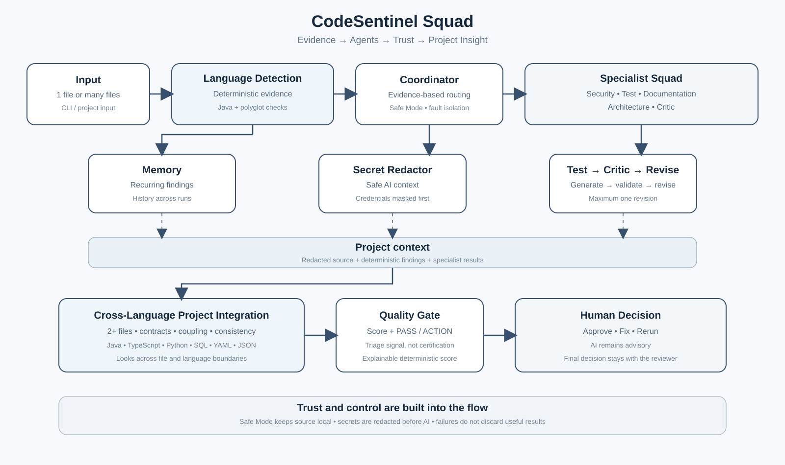

# CodeSentinel Squad — Architecture



## 1. Design principles

| Principle | How it is implemented |
|---|---|
| Evidence before AI | `StaticAnalyzer` runs first, offline, and produces `Finding` objects that guide the later review decisions. |
| Selective routing | Specialist agents implement `shouldRun(...)`; irrelevant agents are skipped and the decision is visible in the report. |
| Generate, then critique | `TestAgent` output is checked locally and then reviewed by `CriticAgent`; one revision is allowed. |
| Memory | `MemoryStore` remembers finding signatures and surfaces recurring defects on later runs. |
| Safe Mode | If `ANTHROPIC_API_KEY` is not set, source stays local while deterministic review and reporting still work. |
| Fault isolation | A specialist failure becomes a warning; other specialists continue. |
| Privacy | `SecretRedactor` masks credential-like values before AI prompts are created. |
| Project awareness | Multiple files receive a separate `Project Integration Agent` pass across file boundaries. |
| Human gate | The quality score is an indicative triage signal, not an automatic release approval. |
| Testability | AI calls sit behind `LlmClient`; tests use a scripted stub and require no network. |

## 2. Components

| Class | Responsibility |
|---|---|
| `Main` | CLI; accepts one or more files/directories and creates the project report when 2+ supported files are reviewed. |
| `LanguageDetector` / `PolyglotAnalyzer` | Detect supported file types and produce lightweight deterministic evidence for non-Java files. |
| `ReviewPipeline` | One-file flow: detect → analyze → memory → coordinate → report → save memory. |
| `StaticAnalyzer` | Fast deterministic Java evidence: secrets, SQL concatenation, broad catch, resource leaks, null-safety chains, transaction hints and architecture signals. |
| `CoordinatorAgent` | Safe Mode handling, redaction, specialist dispatch, Test → Critic → revision loop and failure isolation. |
| `SecurityAgent` / `DocsAgent` / `ArchitectureAgent` / `TestAgent` | Focused file-level specialists. |
| `CriticAgent` | Local structural checks plus AI semantic validation of generated tests. |
| `ProjectIntegrationAgent` | Cross-file review of contracts, coupling, duplicated responsibilities, cross-cutting controls and boundary risks. |
| `ProjectReportGenerator` | Consolidated project report and deterministic quality gate. |
| `ClaudeClient` | JDK `HttpClient` implementation of `LlmClient`; calls the Anthropic Messages API and retries transient failures. |
| `MemoryStore` | Lightweight local recurrence history; no source code is stored. |
| `ReportGenerator` | File-level Markdown reports and generated artifacts. |
| `SecretRedactor` / `TextUtil` | Prompt safety and generated-code cleanup. |

## 3. Routing rules

| Agent | Dispatched when |
|---|---|
| Security Agent | A `Security` finding exists. |
| Test Generation Agent | A public method has a testable finding (`Security`, `Null Safety`, `Error Handling`, `Resource Leak`, `JEE Anti-pattern`). |
| Documentation Agent | A `Documentation` finding exists. |
| Architecture Review Agent | An `Architecture` finding exists. |
| Project Integration Agent | Two or more supported files are supplied. |

The important design choice is that **AI is not the first detector**. Deterministic evidence decides where deeper reasoning is useful.

## 4. Single-file sequence

```text
Main
  |
  v
ReviewPipeline
  |
  +--> LanguageDetector --> Language-aware Analyzer --> findings
  |
  +--> MemoryStore -------------> recurring findings
  |
  +--> Coordinator
         |
         +--> SecretRedactor
         |
         +--> Security
         +--> Test --> Local Critic --> AI Critic --> optional revision
         +--> Documentation
         +--> Architecture
         |
         +--> ReportGenerator
         +--> MemoryStore.save()
````

## 5. Multi-file sequence

```text
                  +--> File A --> Language-aware Analyzer --> Specialists --> File report
                  |
Main --> files ---+--> File B --> Language-aware Analyzer --> Specialists --> File report
                  |
                  +--> File N --> Language-aware Analyzer --> Specialists --> File report
                  |
                  +--> Project Integration Agent
                         |
                         +--> redacted source set
                         +--> per-file evidence
                         |
                         v
                   Project Quality Gate
                         |
                         v
              output/project/project-review.md
```

The project agent is deliberately separate from the per-file agents. This prevents a project review from becoming just N repeated single-file reviews.

## 6. Project Integration Agent

The Project Integration Agent is the main multi-file and cross-language capability.

It receives:

1. the redacted source of the reviewed files;
2. the deterministic findings already produced for each file.

It is instructed to look for evidence of:

* API/DTO/service/repository contract mismatches;
* duplicated business rules or responsibilities;
* inconsistent authentication/authorization;
* inconsistent exception/error handling;
* suspicious coupling or dependency direction;
* shared-state risks;
* missing tests at integration boundaries.

It must not invent a defect simply because a pattern is theoretically possible. Its output is explicitly structured as **Cross-File Risks**, **Strong Design Signals** and **Top 3 Actions**.

## 7. Quality gate

`ProjectReportGenerator` calculates an intentionally simple, explainable score:

* start at 100;
* subtract up to 60 for critical findings;
* subtract up to 25 for major findings;
* subtract up to 10 for minor findings;
* subtract up to 10 for recurring findings.

The score is a triage aid. It is **not** a security certification, compliance score or replacement for human approval.

## 8. Trust and security model

* Static analysis operates on the original local source.
* Before any AI prompt, `SecretRedactor` masks credential-like values.
* API keys are read from environment variables and never written to reports.
* Memory stores finding metadata, not source code.
* Safe Mode performs no AI call.
* Generated tests and documentation are labelled as drafts.
* The project score does not convert AI output into an automatic pass.

## 9. Failure handling

Every specialist is isolated. A failure produces a warning in the report and allows other specialists to continue.

The project review is also isolated from individual reviews: if the project-level call fails, the file-level reports remain valid.

## 10. Extension points

A new file specialist can implement `SpecialistAgent` and be registered with `ReviewPipeline`. A new project-level capability can be added beside `ProjectIntegrationAgent`. The model provider can be replaced by implementing `LlmClient`. New deterministic evidence can be added to `StaticAnalyzer`.

## 11. Key idea

The solution can be explained in one sentence:

> **CodeSentinel turns code review from “ask one AI a big question” into an evidence-driven review squad that selectively reasons, challenges its own output, remembers recurring defects, and finally checks whether the files work together.**
## 12. Polyglot extension

The polyglot capability deliberately adds a thin language boundary rather than separate AI agents for every language. `LanguageDetector` identifies the file type, `StaticAnalyzer` remains the mature Java path, and `PolyglotAnalyzer` provides small deterministic signals for Python, JavaScript, TypeScript, SQL, YAML and JSON. The existing Security, Architecture, memory, reporting and project-integration layers are reused.

This keeps the architecture small while enabling a stronger demo: a TypeScript client, Java service, Python utility, SQL schema and Kubernetes YAML can be supplied together and reviewed as one system. The Project Integration Agent is explicitly instructed to look across language boundaries for contracts, configuration, security and data-flow mismatches.

## 13. Trust boundary

Deterministic findings are evidence signals; they are not presented as proof. AI output is advisory and remains subject to human approval. Secret-like values are redacted before AI prompts, and Safe Mode performs the complete deterministic pass without sending source externally.

This is intentional: trustworthy agentic review requires visible evidence and controlled authority, not autonomous approval.

